# 🎓 ADWEB Cursos Online

> **Plataforma moderna de cursos en línea desarrollada con Vue.js 3, Vuetify y Firebase**

[imagen]

Una solución completa de e-learning que permite a los usuarios explorar, inscribirse y acceder a cursos de programación frontend, con un sistema de gestión administrativa robusto y notificaciones en tiempo real.

---

## 📋 Tabla de Contenidos

- [Características Principales](#-características-principales)
- [Tecnologías Utilizadas](#-tecnologías-utilizadas)
- [Arquitectura del Sistema](#-arquitectura-del-sistema)
- [Instalación y Configuración](#-instalación-y-configuración)
- [Estructura del Proyecto](#-estructura-del-proyecto)
- [Funcionalidades](#-funcionalidades)
- [Roles de Usuario](#-roles-de-usuario)
- [Flujo de Inscripciones](#-flujo-de-inscripciones)
- [Deployment](#-deployment)
- [Scripts Disponibles](#-scripts-disponibles)
- [Estándares de Desarrollo](#-estándares-de-desarrollo)
- [Contribución](#-contribución)
- [Licencia](#-licencia)

---

## ✨ Características Principales

### 🔐 **Sistema de Autenticación Seguro**
- Autenticación con Firebase Authentication
- Roles diferenciados (Administrador/Estudiante)
- Protección de rutas basada en autenticación
- Gestión segura de sesiones

### 📚 **Gestión Completa de Cursos**
- Operaciones CRUD completas para administradores
- Catálogo de cursos con información detallada
- Sistema de cupos y control de inscripciones
- Imágenes optimizadas y relevantes

### 🔔 **Sistema de Notificaciones en Tiempo Real**
- Notificaciones instantáneas para administradores
- Campanita con contador de notificaciones no leídas
- Gestión de solicitudes de inscripción
- Feedback inmediato para usuarios

### 📱 **Diseño Responsivo y Moderno**
- Interfaz adaptativa para todos los dispositivos
- Componentes Material Design con Vuetify
- Animaciones y transiciones fluidas
- Experiencia de usuario optimizada

### 🚀 **Arquitectura Escalable**
- Base de datos en tiempo real con Firestore
- Estado global gestionado con Pinia
- Componentes reutilizables y modulares
- Código limpio y mantenible

[imagen]

---

## 🛠 Tecnologías Utilizadas

### **Frontend**
| Tecnología | Versión | Propósito |
|------------|---------|-----------|
| **Vue.js** | 3.5.22 | Framework principal |
| **Vuetify** | 3.10.5 | UI Framework (Material Design) |
| **Pinia** | 3.0.3 | Gestión de estado global |
| **Vue Router** | 4.5.1 | Enrutamiento SPA |
| **Vite** | 7.1.7 | Build tool y dev server |

### **Backend & Servicios**
| Tecnología | Propósito |
|------------|-----------|
| **Firebase Authentication** | Autenticación de usuarios |
| **Cloud Firestore** | Base de datos NoSQL en tiempo real |
| **Firebase Hosting** | Hosting y deployment |
| **Firebase CLI** | Gestión y deployment |

### **Herramientas de Desarrollo**
| Herramienta | Propósito |
|-------------|-----------|
| **GitHub Actions** | CI/CD Pipeline |
| **ESLint** | Linting de código |
| **Prettier** | Formateo de código |
| **Vue DevTools** | Debugging |

[imagen]

---

## 🏗 Arquitectura del Sistema

### **Arquitectura de Componentes**
```
┌─────────────────────────────────────────┐
│                App.vue                  │
│  ┌─────────────────────────────────────┐│
│  │            NavBar.vue               ││
│  │  ┌─────────────────────────────────┐││
│  │  │     NotificationBell.vue        │││
│  │  └─────────────────────────────────┘││
│  └─────────────────────────────────────┘│
│  ┌─────────────────────────────────────┐│
│  │          RouterView                 ││
│  │  ┌─────────────────────────────────┐││
│  │  │        HomeView.vue             │││
│  │  │  ┌─────────────────────────────┐│││
│  │  │  │   UserCoursesList.vue       ││││
│  │  │  │  ┌─────────────────────────┐││││
│  │  │  │  │    CourseCard.vue       │││││
│  │  │  │  └─────────────────────────┘││││
│  │  │  └─────────────────────────────┘│││
│  │  └─────────────────────────────────┘││
│  └─────────────────────────────────────┘│
└─────────────────────────────────────────┘
```

### **Flujo de Datos**
```
┌──────────────┐    ┌──────────────┐    ┌──────────────┐
│   Firebase   │◄──►│    Pinia     │◄──►│ Components   │
│  (Firestore) │    │   Stores     │    │   (Views)    │
└──────────────┘    └──────────────┘    └──────────────┘
       ▲                     ▲                   ▲
       │                     │                   │
       ▼                     ▼                   ▼
┌──────────────┐    ┌──────────────┐    ┌──────────────┐
│   Services   │    │   Router     │    │     Utils    │
│  (Firebase)  │    │ (Navigation) │    │  (Helpers)   │
└──────────────┘    └──────────────┘    └──────────────┘
```

[imagen]

---

## 🚀 Instalación y Configuración

### **Prerrequisitos**
- Node.js 20.19.0 o superior
- npm o yarn
- Cuenta de Firebase
- Git

### **1. Clonar el Repositorio**
```bash
git clone https://github.com/tu-usuario/adweb-cursos-online.git
cd adweb-cursos-online
```

### **2. Instalar Dependencias**
```bash
npm install
```

### **3. Configurar Firebase**

#### **3.1 Crear Proyecto Firebase**
1. Ve a [Firebase Console](https://console.firebase.google.com/)
2. Crea un nuevo proyecto
3. Habilita Authentication (Email/Password)
4. Crea una base de datos Firestore

#### **3.2 Configurar Variables de Entorno**
Crea un archivo `.env` en la raíz del proyecto:

```env
VITE_FIREBASE_API_KEY="tu-api-key"
VITE_FIREBASE_AUTH_DOMAIN="tu-proyecto.firebaseapp.com"
VITE_FIREBASE_PROJECT_ID="tu-proyecto-id"
VITE_FIREBASE_STORAGE_BUCKET="tu-proyecto.firebasestorage.app"
VITE_FIREBASE_MESSAGING_SENDER_ID="tu-sender-id"
VITE_FIREBASE_APP_ID="tu-app-id"
```

### **4. Inicializar Datos**
```bash
# Crear usuario administrador
node scripts/createAdmin.js

# Poblar base de datos con cursos de prueba
node scripts/seedCourses.js
```

### **5. Ejecutar en Desarrollo**
```bash
npm run dev
```

La aplicación estará disponible en `http://localhost:5173`

[imagen]

---

## 📁 Estructura del Proyecto

```
adweb-cursos-online/
├── 📁 public/                    # Archivos estáticos
├── 📁 scripts/                   # Scripts de utilidad
│   ├── createAdmin.js            # Crear usuario administrador
│   ├── seedCourses.js           # Poblar cursos de prueba
│   └── updateCourseImages.js    # Actualizar imágenes
├── 📁 src/
│   ├── 📁 components/           # Componentes Vue reutilizables
│   │   ├── 📁 admin/           # Componentes administrativos
│   │   │   ├── EnrollmentManager.vue
│   │   │   └── NotificationBell.vue
│   │   ├── 📁 auth/            # Componentes de autenticación
│   │   │   └── AuthGuard.vue
│   │   ├── 📁 common/          # Componentes comunes
│   │   │   ├── LoadingSpinner.vue
│   │   │   └── PageHeader.vue
│   │   ├── 📁 course/          # Componentes de cursos
│   │   │   └── CourseCard.vue
│   │   ├── AdminCoursesManager.vue
│   │   ├── NavBar.vue
│   │   └── UserCoursesList.vue
│   ├── 📁 services/            # Servicios y APIs
│   │   ├── enrollments.js      # Servicio de inscripciones
│   │   └── firebase.js         # Servicios Firebase
│   ├── 📁 stores/              # Estado global (Pinia)
│   │   ├── authStore.js        # Estado de autenticación
│   │   ├── coursesStore.js     # Estado de cursos
│   │   └── enrollmentStore.js  # Estado de inscripciones
│   ├── 📁 utils/               # Utilidades y helpers
│   │   ├── constants.js        # Constantes globales
│   │   └── helpers.js          # Funciones auxiliares
│   ├── 📁 views/               # Páginas principales
│   │   ├── AdminView.vue       # Panel administrativo
│   │   ├── EditarCursoView.vue # Edición de cursos
│   │   ├── HomeView.vue        # Página principal
│   │   ├── LoginView.vue       # Inicio de sesión
│   │   └── RegistroView.vue    # Registro de usuarios
│   ├── 📁 router/              # Configuración de rutas
│   │   └── index.js
│   ├── 📁 firebase/            # Configuración Firebase
│   │   └── config.js
│   ├── App.vue                 # Componente raíz
│   └── main.js                 # Punto de entrada
├── 📁 .github/workflows/       # GitHub Actions
│   └── deploy.yml              # Pipeline de deployment
├── firebase.json               # Configuración Firebase
├── firestore.rules            # Reglas de seguridad
├── vite.config.js             # Configuración Vite
└── package.json               # Dependencias y scripts
```

[imagen]

---

## 🎯 Funcionalidades

### **Para Estudiantes**

#### **🔍 Exploración de Cursos**
- Catálogo completo de cursos disponibles
- Información detallada: precio, duración, cupos
- Imágenes representativas de cada tecnología
- Estados visuales claros (Disponible, En Revisión, Cerrado)

#### **📝 Sistema de Inscripciones**
- Botón de inscripción intuitivo
- Estados de solicitud en tiempo real:
  - ⏳ **Pendiente**: Solicitud enviada, esperando aprobación
  - ✅ **Aprobada**: Acceso completo al curso
  - ❌ **Rechazada**: Con motivo opcional del administrador

#### **🎓 Acceso a Cursos**
- Acceso directo a cursos aprobados
- Interfaz limpia y organizada
- Navegación fluida entre secciones

### **Para Administradores**

#### **📊 Panel de Control**
- Vista completa de todos los cursos
- Tabla interactiva con filtros y búsqueda
- Operaciones CRUD completas
- Estadísticas en tiempo real

#### **🔔 Sistema de Notificaciones**
- Campanita con contador de notificaciones
- Alertas en tiempo real de nuevas solicitudes
- Historial completo de notificaciones
- Marcado de leídas/no leídas

#### **👥 Gestión de Inscripciones**
- Panel dedicado para solicitudes pendientes
- Información completa del solicitante
- Aprobación/rechazo con un clic
- Motivos opcionales para rechazos

#### **📚 Gestión de Cursos**
- Crear, editar y eliminar cursos
- Gestión de cupos e inscritos
- Asignación manual de estudiantes
- Control de estados de cursos

[imagen]

---

## 👥 Roles de Usuario

### **🔧 Administrador**
**Credenciales:** `admin@adweb.cl` / `123456`

**Permisos:**
- ✅ Gestión completa de cursos (CRUD)
- ✅ Recepción de notificaciones en tiempo real
- ✅ Aprobación/rechazo de inscripciones
- ✅ Asignación manual de estudiantes
- ✅ Acceso al panel administrativo
- ✅ Visualización de estadísticas

**Funcionalidades Exclusivas:**
- Campanita de notificaciones en navbar
- Panel de gestión de inscripciones
- Formularios de creación/edición de cursos
- Tabla administrativa con filtros avanzados

### **🎓 Estudiante**
**Credenciales:** Cualquier email registrado

**Permisos:**
- ✅ Visualización del catálogo de cursos
- ✅ Solicitud de inscripciones
- ✅ Acceso a cursos aprobados
- ✅ Visualización del estado de solicitudes
- ❌ Gestión de cursos
- ❌ Acceso al panel administrativo

**Funcionalidades:**
- Catálogo de cursos con información completa
- Botones de inscripción intuitivos
- Estados visuales de solicitudes
- Acceso directo a cursos aprobados

[imagen]

---

## 🔄 Flujo de Inscripciones

### **Proceso Completo**

```mermaid
graph TD
    A[👤 Usuario ve curso] --> B[🖱️ Clic en 'Inscribirse']
    B --> C[📝 Sistema crea solicitud]
    C --> D[🔔 Notificación al admin]
    D --> E[👨‍💼 Admin ve campanita]
    E --> F[📋 Admin abre panel]
    F --> G{🤔 Decisión del admin}
    G -->|✅ Aprobar| H[✅ Usuario agregado al curso]
    G -->|❌ Rechazar| I[❌ Solicitud rechazada]
    H --> J[🎓 Usuario puede acceder]
    I --> K[📧 Notificación de rechazo]
```



### **Estados de Inscripción**

| Estado | Descripción | Acción del Usuario | Acción del Admin |
|--------|-------------|-------------------|------------------|
| **Sin solicitud** | Usuario no ha solicitado inscripción | Puede inscribirse | - |
| **⏳ Pendiente** | Solicitud enviada, esperando | Ver estado | Aprobar/Rechazar |
| **✅ Aprobada** | Inscripción aprobada | Acceder al curso | Gestionar acceso |
| **❌ Rechazada** | Solicitud rechazada | Ver motivo | - |

### **Notificaciones en Tiempo Real**

#### **Para Administradores:**
- 🔔 Nueva solicitud de inscripción
- 📊 Contador de notificaciones no leídas
- 📋 Historial completo de actividad
- ⚡ Actualizaciones instantáneas

#### **Para Estudiantes:**
- ✅ Inscripción aprobada
- ❌ Inscripción rechazada (con motivo)
- 📧 Confirmación de solicitud enviada

[imagen]

---

## 🚀 Deployment

### **GitHub Pages (Automático)**

El proyecto se despliega automáticamente en GitHub Pages cuando se hace push a la rama `main`.

#### **Configuración del Workflow**
```yaml
# .github/workflows/deploy.yml
name: Deploy to GitHub Pages
on:
  push:
    branches: [ main ]
jobs:
  build-and-deploy:
    runs-on: ubuntu-latest
    steps:
    - uses: actions/checkout@v4
    - uses: actions/setup-node@v4
    - run: npm ci
    - run: npm run build
    - uses: peaceiris/actions-gh-pages@v3
```

### **Firebase Hosting (Manual)**

```bash
# Build del proyecto
npm run build

# Deploy a Firebase
firebase deploy --project tu-proyecto-id
```

### **Configuración de Producción**

#### **Variables de Entorno**
Asegúrate de configurar las variables de entorno en tu plataforma de deployment:

```env
VITE_FIREBASE_API_KEY=tu-api-key-produccion
VITE_FIREBASE_AUTH_DOMAIN=tu-dominio-produccion
# ... resto de variables
```

#### **Optimizaciones de Build**
- ✅ Code splitting automático
- ✅ Minificación de assets
- ✅ Compresión gzip
- ✅ Lazy loading de componentes
- ✅ Optimización de imágenes

[imagen]

---

## 📜 Scripts Disponibles

### **Desarrollo**
```bash
# Servidor de desarrollo con hot reload
npm run dev

# Build de producción
npm run build

# Preview del build de producción
npm run preview
```

### **Firebase**
```bash
# Inicializar Firebase en el proyecto
firebase init

# Deploy a Firebase Hosting
firebase deploy --only hosting

# Deploy reglas de Firestore
firebase deploy --only firestore:rules
```

### **Utilidades**
```bash
# Crear usuario administrador
node scripts/createAdmin.js

# Poblar base de datos con cursos de prueba
node scripts/seedCourses.js

# Actualizar imágenes de cursos existentes
node scripts/updateCourseImages.js
```

### **Mantenimiento**
```bash
# Limpiar node_modules y reinstalar
rm -rf node_modules package-lock.json
npm install

# Verificar dependencias desactualizadas
npm outdated

# Actualizar dependencias
npm update
```

[imagen]

---

## 📋 Estándares de Desarrollo

### **✅ Cumplimiento de Requisitos**

#### **1. Funcionalidad y Ejecución**
- ✅ **Sin errores**: Aplicación funcional sin errores de ejecución
- ✅ **Navegación consistente**: Rutas protegidas y navegación fluida
- ✅ **Elementos organizados**: Layout limpio y profesional
- ✅ **Presentación sobresaliente**: UI moderna con Vuetify

#### **2. Funcionalidades Avanzadas**
- ✅ **Más que lo necesario**: Sistema completo de inscripciones + notificaciones
- ✅ **Objetivos superados**: Gestión en tiempo real y UX optimizada

#### **3. HTML Semántico**
- ✅ **Etiquetas representativas**: Uso correcto de elementos HTML5
- ✅ **Separación congruente**: Estructura clara del BODY
- ✅ **Accesibilidad**: Etiquetas ARIA y navegación por teclado

#### **4. Diseño Responsivo**
- ✅ **Dispositivos pequeños**: Adaptación completa a móviles
- ✅ **Breakpoints**: Mobile-first design con Vuetify
- ✅ **Touch-friendly**: Interfaz optimizada para táctil

#### **5. Interacción Clara**
- ✅ **Elementos notables**: Botones y acciones bien definidas
- ✅ **Conducción clara**: UX intuitiva y guiada

#### **6. Framework Utilizado**
- ✅ **Vuetify implementado**: Material Design completo
- ✅ **Personalización**: Estilos adaptados cuando necesario

#### **7. Componentes Reutilizables**
- ✅ **Componentes web**: Arquitectura modular
- ✅ **Reutilización adecuada**: DRY principle aplicado

#### **8. Ciclo de Vida**
- ✅ **Métodos optimizados**: onMounted, onUnmounted correctos
- ✅ **Solución al problema**: Gestión eficiente de recursos

#### **9. Props y Emit**
- ✅ **Comunicación padre-hijo**: Implementación correcta
- ✅ **Reutilización**: Componentes flexibles y configurables

#### **10. Buenas Prácticas de Rutas**
- ✅ **URIs consistentes**: Estructura jerárquica clara
- ✅ **Parámetros por URL**: Edición de cursos con ID
- ✅ **Rutas por defecto**: Redirects y guards implementados

#### **11. JavaScript Moderno**
- ✅ **Sintaxis ES6+**: Arrow functions, destructuring
- ✅ **Declaración correcta**: const, let según contexto
- ✅ **Ciclos y condicionales**: Implementación eficiente

#### **12. ES6/ES7 Avanzado**
- ✅ **Arrow functions**: Uso consistente
- ✅ **Métodos de array**: map, filter, find, etc.
- ✅ **Destructuring**: Parámetros y objetos
- ✅ **Spread operator**: Clonado y merge de objetos

#### **13. Firebase Óptimo**
- ✅ **Integración completa**: Auth + Firestore + Hosting
- ✅ **Acceso restringido**: Solo usuarios autenticados
- ✅ **Reglas de seguridad**: Protección de datos
- ✅ **Validaciones**: Integridad y permisos

#### **14. Vue Data Reactivo**
- ✅ **Objeto data**: Datos reactivos en templates
- ✅ **Computed properties**: Propiedades calculadas
- ✅ **Watchers**: Observadores cuando necesario

#### **15. Pinia Estructurado**
- ✅ **Estructura recomendada**: Stores organizados
- ✅ **Servicios REST**: Encapsulación de Firebase
- ✅ **Estado centralizado**: Gestión eficiente

#### **16. Código Organizado**
- ✅ **Bien organizado**: Estructura clara de carpetas
- ✅ **Indentación**: Formato consistente
- ✅ **Comentarios claros**: Documentación cuando necesario

#### **17. Estándares Web**
- ✅ **HTML, CSS, JS**: Cumplimiento de estándares
- ✅ **Código semántico**: Significado claro
- ✅ **Accesibilidad**: WCAG guidelines

#### **18. Accesibilidad Avanzada**
- ✅ **Etiquetas ARIA**: Screen reader support
- ✅ **Contraste de colores**: WCAG AA compliance
- ✅ **Navegación por teclado**: Tab navigation

#### **19. Código Modular**
- ✅ **Modularidad**: Separación de responsabilidades
- ✅ **Legibilidad**: Código auto-documentado
- ✅ **Reutilización**: Funciones y componentes reutilizables

### **🎨 Metodología BEM**
```css
/* Bloque */
.course-card { }

/* Elemento */
.course-card__title { }
.course-card__description { }

/* Modificador */
.course-card--disabled { }
.course-card__button--primary { }
```

### **🔧 Arquitectura de Componentes**
- **Atomic Design**: Componentes atómicos, moleculares y organismos
- **Single Responsibility**: Cada componente tiene una responsabilidad
- **Props Interface**: Interfaces bien definidas
- **Event Emission**: Comunicación clara padre-hijo

[imagen]

---

## 🤝 Contribución

### **Proceso de Contribución**

1. **Fork** del repositorio
2. **Crear rama** para la feature: `git checkout -b feature/nueva-funcionalidad`
3. **Commit** cambios: `git commit -m 'feat: añadir nueva funcionalidad'`
4. **Push** a la rama: `git push origin feature/nueva-funcionalidad`
5. **Crear Pull Request**

### **Estándares de Código**

#### **Commits Convencionales**
```
feat: nueva funcionalidad
fix: corrección de bug
docs: actualización de documentación
style: cambios de formato
refactor: refactorización de código
test: añadir tests
chore: tareas de mantenimiento
```

#### **Estructura de PR**
```markdown
## Descripción
Breve descripción de los cambios

## Tipo de cambio
- [ ] Bug fix
- [ ] Nueva funcionalidad
- [ ] Breaking change
- [ ] Documentación

## Testing
- [ ] Tests unitarios
- [ ] Tests de integración
- [ ] Testing manual

## Checklist
- [ ] Código sigue los estándares del proyecto
- [ ] Self-review completado
- [ ] Documentación actualizada
```

[imagen]

---

## 📄 Licencia

Este proyecto está bajo la **Licencia MIT**.

```
MIT License

Copyright (c) 2024 ADWEB Cursos Online

Permission is hereby granted, free of charge, to any person obtaining a copy
of this software and associated documentation files (the "Software"), to deal
in the Software without restriction, including without limitation the rights
to use, copy, modify, merge, publish, distribute, sublicense, and/or sell
copies of the Software, and to permit persons to whom the Software is
furnished to do so, subject to the following conditions:

The above copyright notice and this permission notice shall be included in all
copies or substantial portions of the Software.

THE SOFTWARE IS PROVIDED "AS IS", WITHOUT WARRANTY OF ANY KIND, EXPRESS OR
IMPLIED, INCLUDING BUT NOT LIMITED TO THE WARRANTIES OF MERCHANTABILITY,
FITNESS FOR A PARTICULAR PURPOSE AND NONINFRINGEMENT. IN NO EVENT SHALL THE
AUTHORS OR COPYRIGHT HOLDERS BE LIABLE FOR ANY CLAIM, DAMAGES OR OTHER
LIABILITY, WHETHER IN AN ACTION OF CONTRACT, TORT OR OTHERWISE, ARISING FROM,
OUT OF OR IN CONNECTION WITH THE SOFTWARE OR THE USE OR OTHER DEALINGS IN THE
SOFTWARE.
```

---

## 📞 Contacto y Soporte

### **Información del Proyecto**
- **Proyecto**: ADWEB Cursos Online
- **Versión**: 1.0.0
- **Autor**: Bootcamp Aplicaciones Front End Trainee 2025
- **Módulo**: Proyecto Final Módulo 7

### **Enlaces Útiles**
- 🌐 **Demo Live**: [https://tu-usuario.github.io/adweb-cursos-online](https://tu-usuario.github.io/adweb-cursos-online)
- 📚 **Documentación**: [GitHub Wiki](https://github.com/tu-usuario/adweb-cursos-online/wiki)
- 🐛 **Reportar Bugs**: [GitHub Issues](https://github.com/tu-usuario/adweb-cursos-online/issues)
- 💡 **Solicitar Features**: [GitHub Discussions](https://github.com/tu-usuario/adweb-cursos-online/discussions)

### **Tecnologías de Referencia**
- 📖 [Vue.js Documentation](https://vuejs.org/)
- 🎨 [Vuetify Documentation](https://vuetifyjs.com/)
- 🔥 [Firebase Documentation](https://firebase.google.com/docs)
- 🍍 [Pinia Documentation](https://pinia.vuejs.org/)

---

<div align="center">

**🎓 Desarrollado con ❤️ para el aprendizaje y la educación**

[imagen]

*ADWEB Cursos Online - Transformando la educación digital*

</div>